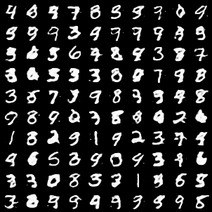

# Idempotent Generative Networks

Unofficial re-implementation of [Idempotent Generative Networks](https://arxiv.org/abs/2311.01462) by *Assaf Shocher, Amil Dravid, Yossi Gandelsman, Inbar Mosseri, Michael Rubinstein, Alexei A. Efros*.

The following image was obtained after 100 epochs with a batch size of 512 and keeping all the other parameters as default. Unlike the original paper, the model uses Dropout2d which I found to help a lot with regularization (i.e. validation loss much lower).

## License
The code is released under the MIT License. See the attached [LICENSE](./LICENSE) file for details.
